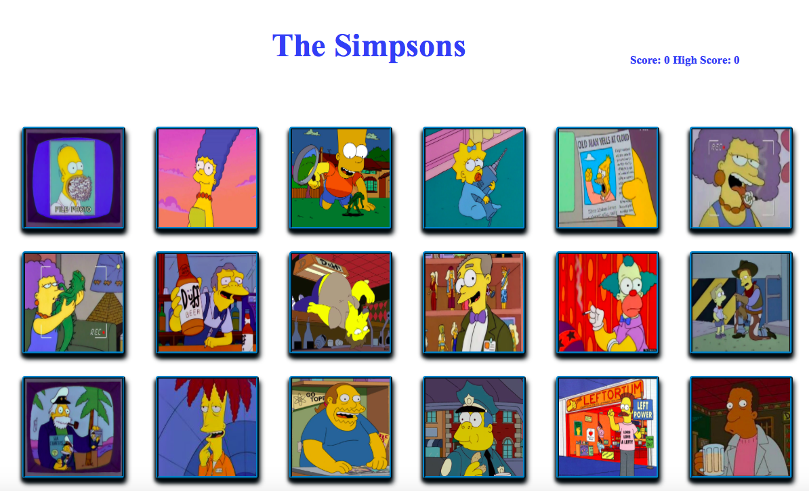

# react-clicker:

## Description: 
A web based memory game using react.js, This application renders different Simpson characters. The users goal is to be able to remember the previous image they clicked on without repeating the same character twice. If they click on the same image twice then the game restarts.

## Image Demo

#### Home Screen

## Deployment

[Heroku Deployment found here](https://young-savannah-55475.herokuapp.com).

